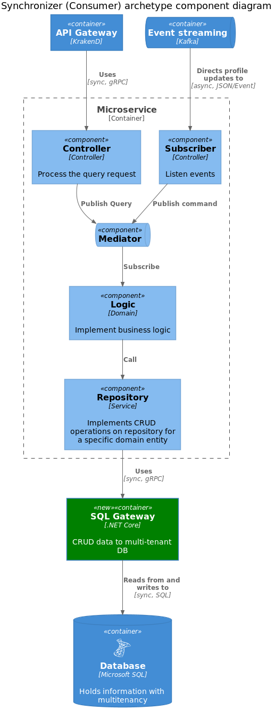

# Synchronizer microservice

## Introduction

This an gRPC API running.

## Getting Started

```bash
dotnet build
dotnet run --project <%= config.projectPrefix %>.<%= config.nameCapitalize %>.Api
```

## Test

```bash
dotnet test /p:CollectCoverage=true /p:CoverletOutputFormat=opencover
```

## Architecture


